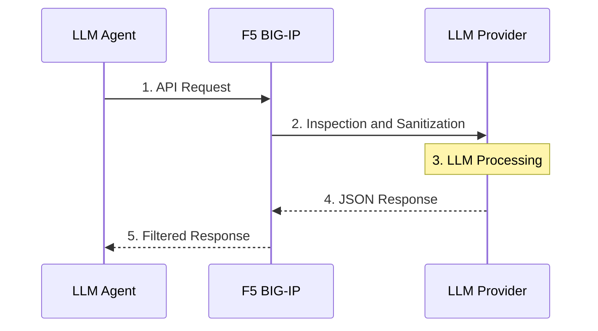

# Securing LLM Agents with F5 BIG-IP: Visibility and Control for OpenClaw and OpenCode

## Introduction

As organizations increasingly adopt LLM Agents such as OpenClaw and OpenCode, the need for robust security and visibility into AI-driven workflows becomes paramount. 

Deploying a BIG-IP as a proxy between the Agent and the LLM provider allows organizations to intercept, inspect, and even modify the communication. In turn, it helps organizations monitor and control the LLM Agents' behavior. Furthermore, it aids in collecting domain knowledge into a centralized conversation history.

### Why This Architecture?

- **Additional Security Control:** A proxy architecture provides another vital layer of security control.
- **Centralized Monitoring:** It provides a centralized point to monitor and enforce the behavior of LLM Agents.
- **Knowledge Retention:** It helps your organization collect all domain knowledge systematically into the conversation history.
- **Deep Packet Inspection (DPI):** BIG-IP can decrypt TLS traffic to inspect the messages array in JSON payloads, identifying sensitive data (PII/PHI) before it leaves the network.
- **Prompt Injection Mitigation:** By analyzing the "System" and "User" prompts, BIG-IP can block known malicious patterns or "jailbreak" attempts designed to bypass AI safety guardrails.
- **Tool Control and Governance:** Enforce which tool functions an LLM agent is allowed to use. Maintain a complete log of every request and response.
- **Rate Limiting & Cost Control:** Prevent "infinite loops" in autonomous agents from draining API credits by enforcing global or per-agent rate limits.
- **Content Filtering:** Scrub toxic or non-compliant output from the LLM response before it reaches the internal Agent environment.

### Topology

The BIG-IP sits strategically in the data path, acting as a "Full Proxy" (Layer 7).

## BIG-IP Setup Requirements

1. **BIG-IP iRules:** Extremely flexible for intercepting traffic, providing deep programmability for the traffic proxy.
2. **BIG-IP TMOS v21 (JSON Profile):** Introduces a native JSON profile feature that significantly simplifies proxying LLM JSON payloads.

### Use Case 1: Controlling LLM Agent Behavior with BIG-IP v17.1 iRules

- **Agent:** OpenClaw Agent using an OpenAI-compatible API
- **Environment:** BIG-IP v17.1 with iRules

#### iRule Configuration
> [**View the complete v17.1 System Prompt iRule on GitHub**](https://github.com/a11ensu/a11ensu.github.io/blob/main/assets/code/irule-v17-system-prompt.tcl)

#### Demo

*(Paste your YouTube video link here: `[Watch the Demo on YouTube](https://youtu.be/...)`)*

### Use Case 2: Controlling LLM Agent Behavior via Prompts with BIG-IP v21 JSON Profile

- **Agent:** OpenClaw Agent using an OpenAI-compatible API
- **Environment:** BIG-IP v21 using Native JSON Profile Events

#### iRule Configuration
> [**View the complete v21 System Prompt via JSON Profile iRule on GitHub**](https://github.com/a11ensu/a11ensu.github.io/blob/main/assets/code/irule-v21-json-prompts.tcl)

#### Demo

*(Paste your YouTube video link here: `[Watch the Demo on YouTube](https://youtu.be/...)`)*

### Use Case 3: Controlling LLM Agent Tool Calling Behavior with BIG-IP v21 JSON Profile

- **Agent:** OpenClaw Agent using an OpenAI-compatible API
- **Environment:** BIG-IP v21 using Native JSON Profile Events

#### iRule Configuration
> [**View the complete v21 Tool Calling Behavior iRule on GitHub**](https://github.com/a11ensu/a11ensu.github.io/blob/main/assets/code/irule-v21-json-tools.tcl)

#### Demo

*(Paste your YouTube video link here: `[Watch the Demo on YouTube](https://youtu.be/...)`)*

## Conclusion

Placing F5 BIG-IP in the middle of the LLM communication chain elevates AI traffic to the security rigor of traditional web applications. Whether you manipulate strings in TMOS v17 or leverage the elegant, structured JSON Profile in v21 for precise tool authorization, this architecture provides the strategic visibility and control needed to transition open-source LLM Agents from experimental sandboxes into production-ready enterprise environments safely.
